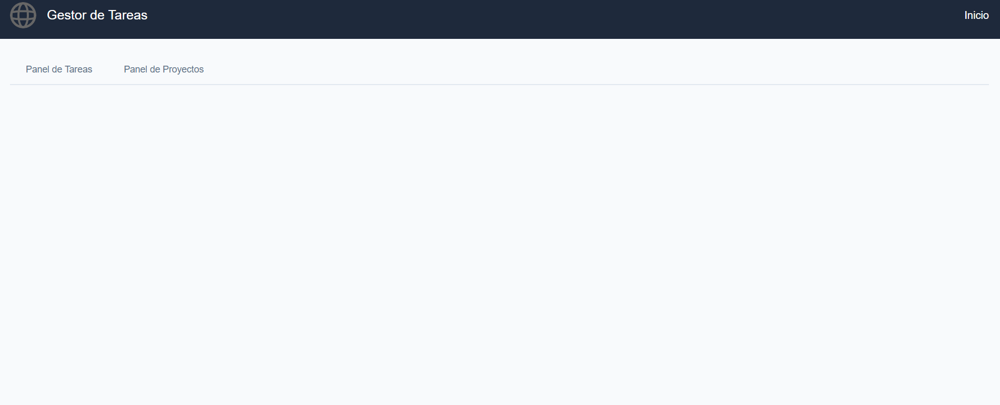
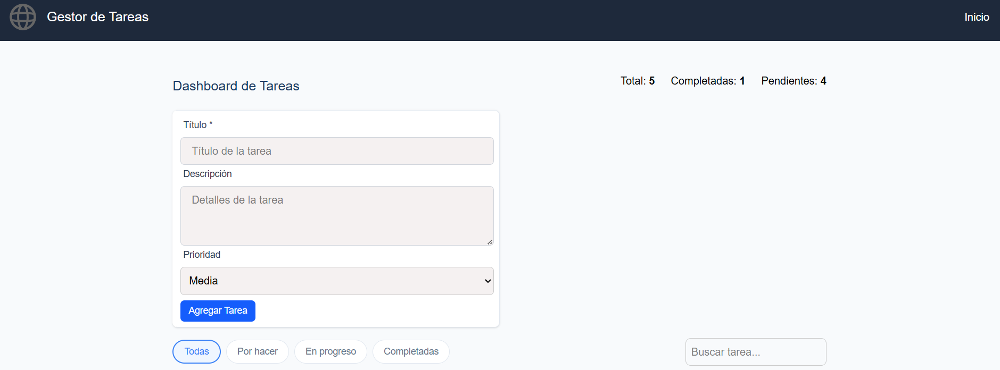
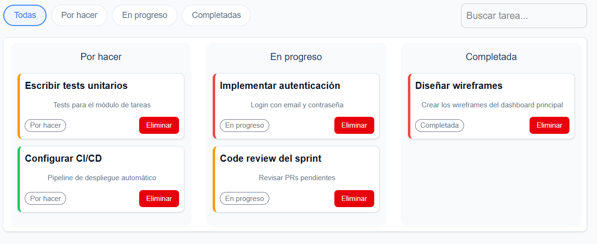
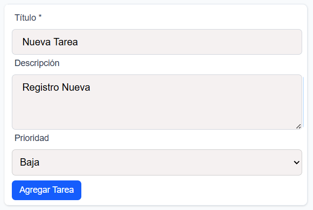
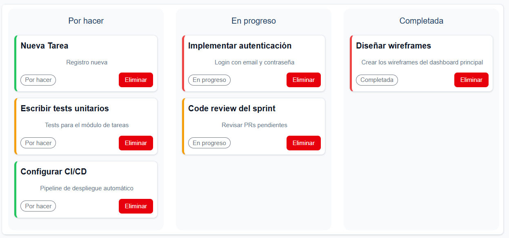
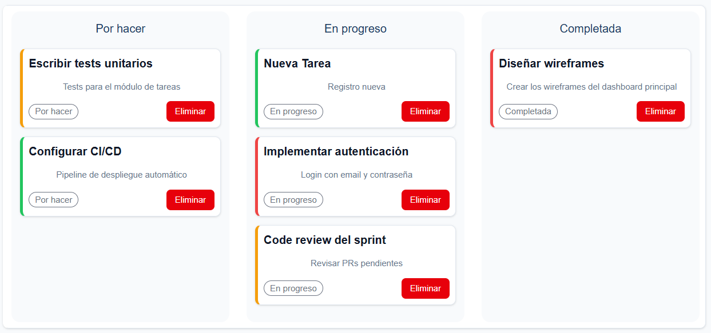

# TaskFlow Next

## Información del Curso

**Curso:** React Avanzado  

## Descripción del Proyecto

TaskFlow Next es una aplicación web para la gestión de tareas y proyectos, desarrollada con Next.js, React y TailwindCSS. Permite crear, listar, filtrar y organizar tareas y proyectos de manera eficiente, utilizando una arquitectura modular y escalable.

## Arquitectura y Estructura del Proyecto

El proyecto sigue una arquitectura basada en features y componentes reutilizables. Las principales carpetas son:

- **/src/app/**: Páginas principales de la aplicación (Next.js App Router).
- **/src/features/**: Lógica de negocio agrupada por dominio (taskManagement, projectsManagement).
- **/src/contexts/**: Contextos globales de React para manejo de estado y temas.
- **/src/hooks/**: Custom hooks reutilizables.
- **/src/services/**: Servicios para acceso a datos y lógica externa.
- **/src/shared/**: Componentes UI reutilizables (atoms, molecules, components).
- **/public/**: Recursos estáticos.


### Tecnologías principales
- Next.js
- React
- TailwindCSS
- TypeScript
- Jest (testing)

## Estructura de Carpetas
src/
	app/                # Páginas principales (Next.js)
		projects/         # Página de proyectos
		tasks/            # Página de tareas
	features/
		projectsManagement/   # Lógica de proyectos
		taskManagement/       # Lógica de tareas
	contexts/           # Contextos globales
	hooks/              # Custom hooks
	services/           # Servicios de datos
	shared/
		components/       # Componentes compartidos
		ui/               # Átomos y moléculas UI
public/               # Recursos estáticos


## Testing

El proyecto utiliza **Jest** para la ejecución de pruebas unitarias y de integración.

Para ejecutar los tests:

```bash
npm test # o yarn test
```

## Instalación y Ejecución

1. Clona el repositorio:
	 ```bash
	 git clone [URL_DEL_REPOSITORIO]
	 cd taskflow-next
	 ```
2. Instala las dependencias:
	 ```bash
	 npm install  # o  yarn install
	 ```
3. Inicia el servidor de desarrollo:
	 ```bash
	 npm run dev # o yarn dev
	 ```
4. Abre (http://localhost:3000) en tu navegador.

# TaskFlow Next

## Información del Curso

**Curso:** React Avanzado  

## Descripción del Proyecto

TaskFlow Next es una aplicación web para la gestión de tareas y proyectos, desarrollada con Next.js, React y TailwindCSS. Permite crear, listar, filtrar y organizar tareas y proyectos de manera eficiente, utilizando una arquitectura modular y escalable.

## Arquitectura y Estructura del Proyecto

El proyecto sigue una arquitectura basada en features y componentes reutilizables. Las principales carpetas son:

- **/src/app/**: Páginas principales de la aplicación (Next.js App Router).
- **/src/features/**: Lógica de negocio agrupada por dominio (taskManagement, projectsManagement).
- **/src/contexts/**: Contextos globales de React para manejo de estado y temas.
- **/src/hooks/**: Custom hooks reutilizables.
- **/src/services/**: Servicios para acceso a datos y lógica externa.
- **/src/shared/**: Componentes UI reutilizables (atoms, molecules, components).
- **/public/**: Recursos estáticos.

### Tecnologías principales
- Next.js
- React
- TailwindCSS
- TypeScript
- Jest (testing)

## Estructura de Carpetas
src/
	app/                # Páginas principales (Next.js)
		projects/         # Página de proyectos
		tasks/            # Página de tareas
	features/
		projectsManagement/   # Lógica de proyectos
		taskManagement/       # Lógica de tareas
	contexts/           # Contextos globales
	hooks/              # Custom hooks
	services/           # Servicios de datos
	shared/
		components/       # Componentes compartidos
		ui/               # Átomos y moléculas UI
public/               # Recursos estáticos

## Decisiones de Arquitectura: Memorización de Componentes

Para optimizar el rendimiento y evitar renders innecesarios, se han memoizado componentes y hooks clave:

- **TaskCard** y **TaskFilters**: Se utiliza `React.memo` para evitar renders si las props no cambian, ya que estos componentes pueden renderizarse muchas veces en listas grandes.
- **useTasks**, **useTaskFilter**, **ThemeContext**: Se emplea `useMemo` para calcular valores derivados (como tareas filtradas, totales, tema) solo cuando sus dependencias cambian.
- **useAsync**: Utiliza `useCallback` para evitar recrear funciones en cada render.

**Motivo:**
La memoización se aplica en componentes que reciben muchas props o que forman parte de listas, y en hooks que calculan valores derivados costosos. Así se mejora la eficiencia y la experiencia de usuario, especialmente en listas grandes o con muchos cambios de estado.

Más detalles y ejemplos de optimización pueden encontrarse en [OPTIMIZATIONS.md](./OPTIMIZATIONS.md).


## Testing

El proyecto utiliza **Vitest** junto con **@testing-library/react** para la ejecución de pruebas unitarias y de integración.

- **Vitest** es el framework principal de testing, compatible con Jest, rápido y moderno para proyectos con Vite/Next.js.
- **@testing-library/react** se usa para pruebas de componentes y hooks, simulando la interacción del usuario y el comportamiento real de la app.
- El entorno de pruebas es **jsdom** (simulación de navegador en Node.js).
- Los archivos de pruebas se encuentran en `src/__tests__/` y cubren tanto hooks personalizados como componentes y flujos de integración.
- El archivo `vitest.setup.ts` configura utilidades globales para los tests.

### Ejecución de tests

Para ejecutar todos los tests por consola:

```bash
npm test # o yarn test
```

Para una interfaz visual de los tests:

```bash
npm run test:ui
```

Los resultados de cobertura se generan automáticamente en la carpeta `coverage/` tras ejecutar los tests.

## Instalación y Ejecución

1. Clona el repositorio:
	 ```bash
	 git clone [URL_DEL_REPOSITORIO]
	 cd taskflow-next
	 ```
2. Instala las dependencias:
	 ```bash
	 npm install  # o  yarn install
	 ```
3. Inicia el servidor de desarrollo:
	 ```bash
	 npm run dev # o yarn dev
	 ```
4. Abre (http://localhost:3000) en tu navegador.

## Capturas de Pantalla











